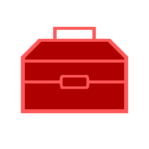

<div align="center">
    
    <h1 align="center" style="color: red;">My Library Package</h1>
</div>

<a></a>
<div align="center">

[//]: # ()

<a href="https://github.com/em-d3v/em-pkg">

</a>
<a href="https://www.npmjs.com/package/em-pkg">

</a>
<br/>
<hr/>


<br>


<br>

</div>
<div align="center">
  
<br>
  

</div>


My collection of classes, scripts, enums, etc. See [docs](https://github.com/em-d3v/em-pkg/tree/main/docs) for more information

I made this pkg so that I can reuse styles, js code, etc. for my other projects.

Contains:
- modules (js/ts)
- css style sheets
- tools

style sheets:
```
<link rel="stylesheet" href="https://unpkg.com/em-pkg@:version/src/styles/[sheetname].css">
```
scripts:
```
<script type="importmap">
{
  "em-pkg": "https://https://cdn.jsdelivr.net/npm/em-pkg@:version/build/:pathToFile"
}
</script>

<script src="https://https://cdn.jsdelivr.net/npm/em-pkg@:version/build/:pathToFile"></script>
```

**Note: I am the sole developer of this package, so this may get messy. May also contain errors.**

Github

[//]: # (<iframe src=""></iframe>)

[//]: # (> ![discussions]&#40;https://img.shields.io/github/discussions/em-d3v/em-pkg&#41;)

 [](LICENSE.md)
 [](CHANGELOG.md)

[//]: # ( [![contributors]&#40;https://custom-icon-badges.demolab.com/static/v1?label&message=CONTRIBUTING&logo=pencil&#41;]&#40;./CONTRIBUTING.md&#41;)


