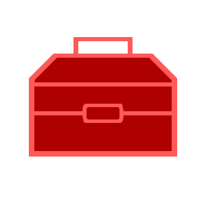

<div align="center" style="padding: 0;">
<div>

</div>

[![npm][npm]][npm-url]
[![github][github-pkg]](https://github/em-d3v/em-pkg)
<br/>


<br>
[![issues][issues]](https://github.com/em-d3v/em-pkg/issues)
[![repo][repo]](https://github.com/em-d3v/em-pkg)
![node][node]

[![badge][nodei]](https://www.npmjs.com/package/em-pkg)

![codesize][size]
<h1 id="top" style="color: #ff6ed7;">EM-PKG</h1>
</div>

A collection of scripts, classes, schemas, etc.

<a href="https://e-d3v.gitbook.io/em-pkg/">

</a>


# Table of Contents

- [Overview](#overview)
- [Usages](#access)

## Overview

> This is my first package.  
> I didn't want to have to constantly copy and paste stuff, so I decided to make this library instead.
> That way, I can reuse my content
> package content (in general):
> - modules/classes 
>   - Programming Languages: [typescript](https://www.typescriptlang.org/docs/)
>   - 
> - stylesheets
> - schemas
> - templates
>
> These

Other info  
- Programming Languages
  - modules,classes - javascript/typescript
  - stylesheets - sass, css
- Software
  - VSCode
  - Webstorm
  - Nodejs

| topic                      | description                    |
|----------------------------|--------------------------------|
| Programming <br> Languages | javascript <br> typescript css |
|                            |                                |
|                            |                                |

---

<h1 id="access" style="color: deeppink">Usages</h1>
<mark><strong>Be sure to replace :version with the latest package version!</strong></mark>

- package :package:
    ```
    npm install em-pkg
    ```
- Modules
    - html:
      ```html
        <script src="https://cdn.jsdelivr.net/npm/em-pkg@:version/build/jsm/build.min.js" type="module"></script>
      ```
      ```html
        <script src="https://unpkg.com/em-pkg@:version/build/jsm/build.min.js" type="module"></script>
      ```
    - script (type="importmap"):
      ```
      "em-pkg": "https://https://cdn.jsdelivr.net/npm/em-pkg@:version/build/jsm/build.min.js"
      ```
      ```
      "em-pkg": "https://https://unpkg.com/em-pkg@:version/build/jsm/build.min.js"
      ```
      if you don't know or have never used "importmap" type before,
      this is what it looks like:
      ```html
      <script type="importmap">
      {
        "pkg-name": "package-url"
      }
      </script>
      ```
- Style Sheets
    - link:
      ```html
        <link rel="stylesheet" href="https://unpkg.com/em-pkg@:version/build/css/[sheetname].css">
      ```
      ```html
        <link rel="stylesheet" href="https://cdn.jsdelivr.net/npm/em-pkg@:version/build/css/[sheetname].css">
      ```
- Schemas
  ```json
  { 
  "$schema": "https://cdn.jsdelivr.net/npm/em-pkg@:version/schema/[schemafile].json"
  }
  ```
  ```json
   {
   "$schema": "https://unpkg.com/em-pkg@:version/schema/[schemafile].json"
   }
  ```

[//]: # ([![return]&#40;&#41;]&#40;#top&#41;)
[ :arrow_up: Return](#top)

---
footnotes

[gitbook]:https://img.shields.io/badge/documentation-444?logo=gitbook
[gitbook-url]: https://em-d3v.gitbook.io/em-pkg/
[github-pkg]: https://img.shields.io/github/package-json/v/em-d3v/em-pkg?logo=Github
[github-release]: https://custom-icon-badges.demolab.com/github/v/release/em-d3v/em-pkg?logo=package
[issues]: https://custom-icon-badges.demolab.com/github/issues/em-d3v/em-pkg?logo=issue
[node]: https://img.shields.io/node/v/em-pkg
[npm-url]: https://npmjs.com/package/em-pkg
[npm-status]: https://nodei.co/npm/em-pkg.png
[npm]: https://img.shields.io/npm/v/em-pkg?logo=npm
[nodei]: https://nodei.co/npm/em-pkg.png?stars=true&dowloads=true
[publish]: https://github.com/em-d3v/em-pkg/actions/workflows/publish.yml/badge.svg
[repo]: https://custom-icon-badges.demolab.com/badge/Repository-999?logo=repo&style=plastic
[size]: https://img.shields.io/github/languages/code-size/em-d3v/em-pkg